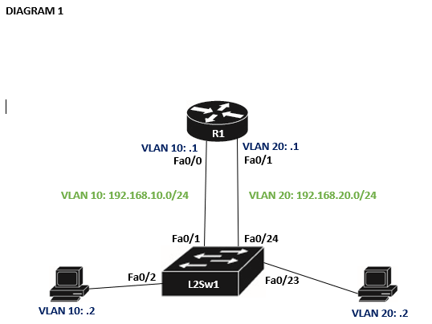
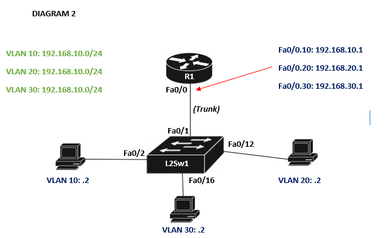
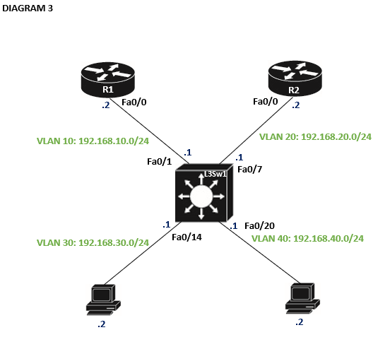
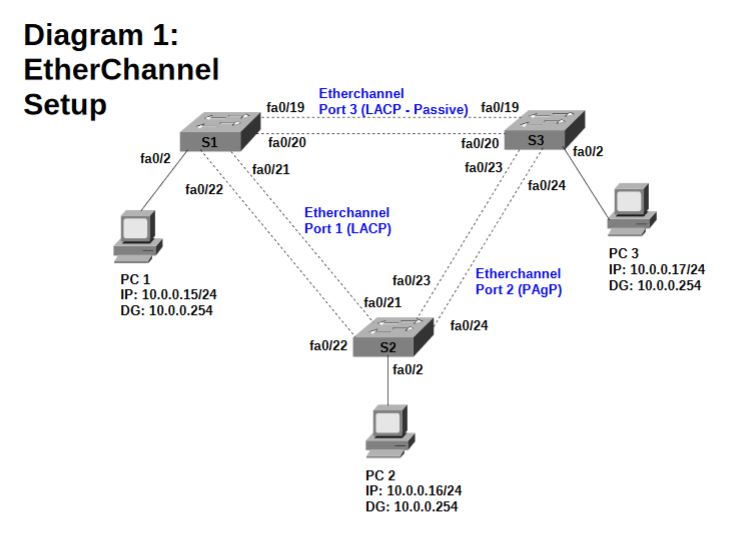
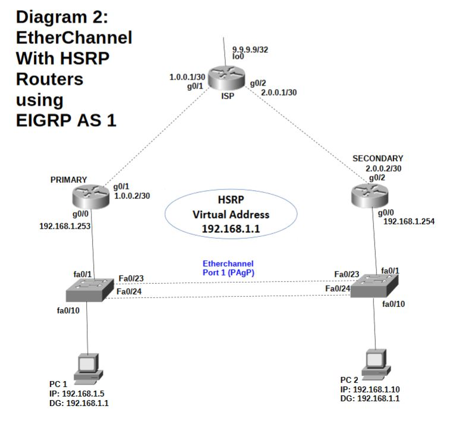
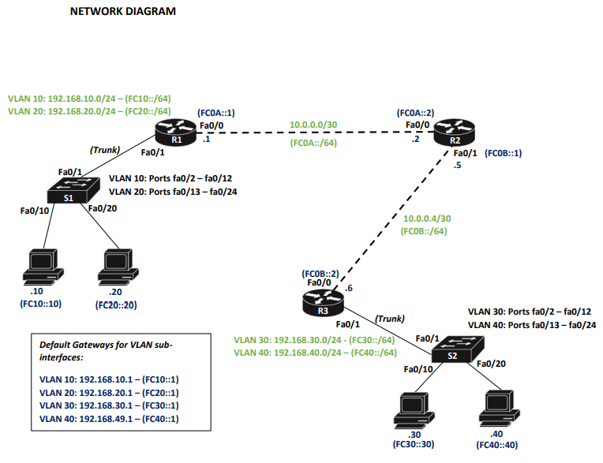

# Subnet Table
| Shorthand | Mask            | Wildcard        | Number Addresses | Network Bits |
| --------- | --------------- | --------------- | ---------------: | -----------: |
| /32       | 255.255.255.255 | 0.0.0.0         |                1 |          N/A |
| /31       | 255.255.255.254 | 0.0.0.1         |                2 |            1 |
| /30       | 255.255.255.252 | 0.0.0.3         |                4 |            2 |
| /29       | 255.255.255.248 | 0.0.0.7         |                8 |            3 |
| /28       | 255.255.255.240 | 0.0.0.15        |               16 |            4 |
| /27       | 255.255.255.224 | 0.0.0.31        |               32 |            5 |
| /26       | 255.255.255.192 | 0.0.0.63        |               64 |            6 |
| /25       | 255.255.255.128 | 0.0.0.127       |              128 |            7 |
| /24       | 255.255.255.0   | 0.0.0.255       |              256 |            8 |
| /23       | 255.255.254.0   | 0.0.1.255       |              512 |            9 |
| /22       | 255.255.252.0   | 0.0.3.255       |            1,024 |           10 |
| /21       | 255.255.248.0   | 0.0.7.255       |            2,048 |           11 |
| /20       | 255.255.240.0   | 0.0.15.255      |            4,096 |           12 |
| /19       | 255.255.224.0   | 0.0.31.255      |            8,192 |           13 |
| /18       | 255.255.192.0   | 0.0.63.255      |           16,384 |           14 |
| /17       | 255.255.128.0   | 0.0.127.255     |           32,768 |           15 |
| /16       | 255.255.0.0     | 0.0.255.255     |           65,536 |           16 |
| /15       | 255.254.0.0     | 0.1.255.255     |          131,072 |           17 |
| /14       | 255.252.0.0     | 0.3.255.255     |          262,144 |           18 |
| /13       | 255.248.0.0     | 0.7.255.255     |          524,288 |           19 |
| /12       | 255.240.0.0     | 0.15.255.255    |        1,048,576 |           20 |
| /11       | 255.224.0.0     | 0.31.255.255    |        2,097,152 |           21 |
| /10       | 255.192.0.0     | 0.63.255.255    |        4,194,304 |           22 |
| /9        | 255.128.0.0     | 0.127.255.255   |        8,388,608 |           23 |
| /8        | 255.0.0.0       | 0.255.255.255   |       16,777,216 |           24 |
| /7        | 254.0.0.0       | 1.255.255.255   |       33,554,432 |          N/A |
| /6        | 252.0.0.0       | 3.255.255.255   |       67,108,864 |          N/A |
| /5        | 248.0.0.0       | 7.255.255.255   |      134,217,728 |          N/A |
| /4        | 240.0.0.0       | 15.255.255.255  |      268,435,456 |          N/A |
| /3        | 224.0.0.0       | 31.255.255.255  |      536,870,912 |          N/A |
| /2        | 192.0.0.0       | 63.255.255.255  |    1,073,741,824 |          N/A |
| /1        | 128.0.0.0       | 127.255.255.255 |    2,147,483,648 |          N/A |
| /0        | 0.0.0.0         | 255.255.255.255 |    4,294,967,296 |          N/A |
           

## Identifying Masks without Shorthand
- If the prefix/mask is known, calculate the block size and determine which range contains the host address. The IP address alone does not identify the subnet mask.

# Basic Router Configuration
## Clearing out previous configuration on Routers & Switches:
Configuration:
- Enter privilege mode (ensure terminal starts with `#`)
- Enter `write erase`
- Message for erasing the nvram filesystem will remove all configuration files
- Confirm
- Look at log messages, should see `Erase of nvram: complete`
- CTRL+R will bring the line back to the point you were writing before the confirmation message, or hit enter to move to a new line
- This has restored the default configuration
- Command only necessary for switches: `del vlan.dat`. On a router this will do nothing.
- Confirm delete action
- Delete copy in the flash, confirm this as well
- If an error message is displayed saying the file is not on the flash, ignore (the file was not on flash to begin with)
- Reboot router or switch - command `reload`
- Confirm reload. If config is asked to be saved before reload, select "no"
- @ signs mean switch in reboot message, # signs mean router. ? means that there is a corruption somewhere

Configuration:
- Connect via Cabling
- Open MobaXTerm
- `enable`
- `configure terminal`
- `hostname <name>` - eg `hostname R1`
- Configure ports
    - Identify IP address of each port to be bound
    - Compare last octet of each address to bit borrowing table to get Mask (.66 falls within /27 range, for example)
    - `interface fax/x` (eg `fa0/0`) for 2811
    - `interface gx/x` for 2911
    - `interface gx/x/x` for 4331
    - `ip address <ip address> <mask>` - ex `interface fa0/0`, `ip address 192.168.1.137 255.255.255.252`
    - Turn on the port `no shutdown`/`no shut`
    - `exit`
- If on Packettracer and connection to a switch is RED - troubleshoot port:
    - Hover over arrow on each side of the connection to see what port has been configured closest to the device
    - If trying to connect to 0/1 it may automatically bind to 0/0
        - To fix this hold click on the end of the connection to change
        - Click the device
        - Select the port to plug into

# VLANs
## Legacy Inter-VLAN Routing
- Equipment:
    - Routers: 2621XM, 1841 or 2811 series
    - Switches: 2960 or 2950 series
    - PCs
- Cable up network from diagram - take care to ensure cables are in correct ports. Best to do PCs -> Switch first and then Switch -> Router so VLAN ports do not have their ports overtaken

Example:

### Switch Config
- `enable`
- `configure terminal`
- `hostname <name>` - eg `hostname s1`
- `vlan <number>` - eg `vlan 10`
- `name <name` - eg `name Sales`
- configure other VLANs if required
- `interface range port-port` - eg `interface range fa0/1-12`
- `switchport mode access`
- `switchport access vlan <number>` - eg `switchport access vlan 10`
- `no shut`
- `exit`

Debug using `show vlan` (or `do show vlan` if in privileged mode) - you should see the port ranges appearing under the VLAN

### Router Config
- `enable`
- `configure terminal`
- `hostname <name>` - eg `hostname r1`
- configure receiving ports (on diagram this is fa0/0, fa0/1)
- `interface <port>` - eg `interface fa0/0`
- `ip address <ip address> <mask address>` - for VLAN10 in this diagram this would be `ip address 192.168.10.1 255.255.255.0` - the `.0` address is the network address for a `/24` subnet and is therefore not normally assignable to a host interface. The router interface is typically assigned a usable address such as `.1`. Look for green text to determine IP address and use the modifier next to the VLAN name (`.1`) - *NOTE* this becomes the gateway for any client attached to this VLAN
- `no shut`
- configure other ports by repeating the above steps

### Device Config
- Enter device
- IP Configuration
- Static
- Set IPv4 address to the first three octets of the VLAN address using the address specified on the device in the diagram as the last octet (`.2` for VLAN10 in the diagram) - eg `192.168.10.2` for VLAN10 in the diagram
- Subnet mask should be configured automatically - should match mask address specified on the router
- Set default gateway to the first three octets of the VLAN address - use the router port address as the last octet (`192.168.10.1` for VLAN 10 in the above diagram)

## Single Interface Inter-VLAN Routing ("Router on a Stick")
- Equipment:
    - Routers: 2621XM, 1841 or 2811 series
    - Switches: 2960 or 2950 series
    - PCs
- Cable up network from diagram - take care to ensure cables are in correct ports. Best to do PCs -> Switch first and then Switch -> Router so VLAN ports do not have their ports overtaken
- Divides one single physical router port into sub-interfaces - each sub-interface belongs to a distinct VLAN. Less ports used = cheaper.

Example:

### Switch Config
- `enable`
- `configure terminal`
- `hostname <name>` - eg `hostname s1`
- `vlan <number>` - eg `vlan 10`
- `name <name` - eg `name Sales`
- configure other VLANs if required
- `interface range port-port` - eg `interface range fa0/1-12`
- `switchport mode access`
- `switchport access vlan <number>` - eg `switchport access vlan 10`
- `no shut`
- `exit`
- Configure trunk port
    - `interface port` - in this example the trunk port to the router is `interface fa0/1`
    - `switchport trunk encapsulation dot1q` - only required for layer 3 switches
    - `switchport mode trunk`
    - `exit`
- Check VLANs are configured correctly (`do show vlan`/`show vlan`)

### Router Config
- `enable`
- `configure terminal`
- `hostname <name>` - eg `hostname r1`
- Configure sub-interfaces
- `interface port/.vlan_number` - in this example the first sub-interface we configure is `interface fa0/0.10`
- `encapsulation dot1q vlan_number` - `encapsulation dot1q 10`
- `ip address <ip address> <mask address>` - one address per sub-interface which are defined in green on the diagram - in the above example `192.168.10`, `192.168.20`, `192.168.30` - the last octet is set to `.1` and will be the gateway address for any PC attached to the VLAN. In the above diagram the full addresses are `192.168.10.1`, `192.168.20.1`, and `192.168.30.1`
- `exit`
- Repeat above steps for each sub-interface that needs to be defined
- Configure the receiving end of the trunk port
- `interface port` - ex `interface fa0/0`
- `no shutdown`
- `exit`

### Device Config
- Enter device
- IP Configuration
- Static
- Set IPv4 address to the first three octets of the VLAN address using the address specified on the device in the diagram as the last octet (`.2` for VLAN10 in the diagram) - eg `192.168.10.2` for VLAN10 in the diagram
- Subnet mask should be configured automatically - should match mask address specified on the router
- Set default gateway to the first three octets of the VLAN address - use the router port address as the last octet (`192.168.10.1` for VLAN 10 in the above diagram)

## Elegant Inter-VLAN Routing - Layer 3 Switch
- Equipment:
    - Routers: 2621XM, 1841 or 2811 series
    - Switches: 3560 Layer 3 Switch
    - PCs

Example:

### Router Config
- `enable`
- `configure terminal`
- `hostname <name>` - eg `hostname r1`
- Enable EIGRP
    - `router eigrp 1`
    - Configure physical network connections
    - `network <address>` - in the diagram we only have one connection (`192.168.10.0`) for R1
    - Configure ports
        - `interface <port>` - eg `interface fa0/0`
        - `no shut`
        - `exit`
        - Repeat for all other ports (if required)
- Repeat for other routers (R2 in the above diagram would use `network 192.168.20.0`)

### Switch Config
- `enable`
- `configure terminal`
- `hostname <name>` - eg `hostname l3sw1`
- Configure VLANs - in the above diagram there is 4 - `10`, `20`, `30` and `40`
    - `vlan <number>` - eg `vlan 10`
    - `name <name>` - eg `name Sales`
    - configure other VLANs if required
    - `interface range port-port` - eg `interface range fa0/1-12`
    - `switchport mode access`
    - `switchport access vlan <number>` - eg `switchport access vlan 10`
    - `no shut`
    - `exit`
- Configure trunk ports if required
- EIGRP needs configuring for R1 and R2
- `ip routing` - enable routing functions of L3 Switch
- Assign the four VLANs IP addresses (use `.1` modifier to prevent IP clashing)
    - `interface VLAN <number>` - eg `interface VLAN 10` message may appear saying state is up
    - `ip address <address> <mask>` - eg for VLAN 10 this would be `ip address 192.168.10.1 255.255.255.0`
    - Repeat above steps for each VLAN
- Enable EIGRP
    - `router eigrp 1`
    - `network <address>` - repeat for each VLAN address (use `.0` for the last octet of each address) - eg `192.168.10.0`
    - `exit`

### Device Config
- Enter device
- IP Configuration
- Static
- Set IPv4 address to the first three octets of the VLAN address using the address specified on the device in the diagram as the last octet (`.2` for VLAN30 in the diagram) - eg `192.168.30.2` for VLAN30 in the diagram
- Subnet mask should be configured automatically - should match mask address specified on the router
- Set default gateway to the first three octets of the VLAN address - use the router port address as the last octet (`192.168.30.2` for VLAN 30 in the above diagram)
- Repeat for other devices

# EtherChannel (PAgP + LACP)
- Equipment:
    - Switches: 2960
    - PCs

Configuration
- Create switches and cable up PCs - DO NOT ADD CROSSOVER CABLES BETWEEN SWITCHES
- Use configuration defined for each PC for setting IP config
- Make switches pingable as no routers on the network:
    - `interface VLAN 1`
    - `ip address <address> <mask>` - for S1 this is `ip address 10.0.0.5 255.255.255.0`. You can find the IP used by using the same IP as the connected PC and take the last digit (`5` for S1)
    - `no shut`
    - `exit`
    - `ip default-gateway <ip address>` - eg `ip default-gateway 10.0.0.254` this is the DG specified on the PCs within the diagram above
    - Repeat for all switches within the network
- Set up EtherChannel trunks:
    - LACP (Passive)
        - `interface range <port-range>` - for diagram above when configuring S1 this would be `fa0/19-20` as defined by the crossover cables, ports 19 and 20 are defined as using LACP Passive
        - `channel-group 3 mode passive`
        - `exit`
        - Use EtherChannel as trunk:
            - `interface port-channel 3`
            - `switchport mode trunk`
            - `exit`
    - LACP
        - `interface range <port-range>` - for diagram above when configuring S1 this would be `fa0/21-22`
        - `channel-group 1 mode active`
        - `exit`
        - Use EtherChannel as trunk:
            - `interface port-channel 1`
            - `switchport mode trunk`
            - `exit`
    - PAgP
        - `interface range <port-range>` - for diagram above when configuring S2 this would be `fa0/23-24`
        - `channel-group 2 mode desirable`
        - `exit`
        - Use EtherChannel as trunk:
            - `interface port-channel 2`
            - `switchport mode trunk`
            - `exit`
    - These commands need to be ran on both sides of the connection
    - An error may be encountered when setting these up where it says the method is not enabled on the port, this is fine and resolves itself if/when the switches are connected.
    - Ports may take quite a while to stabilise so give them chance to turn green, they may go up and down between green and red
    - Some may also appear as red but will work fine, test connectivity to ensure network works as expected

# Loopback Interfaces
- Equipment:
    - Switches: 2960 or 2950 series

Configuration:
- `interface <port>` - eg `interface Loopback0` or `interface lo0`
- `ip address <address> <mask>` - eg `ip address 9.9.9.9 255.255.255.255`
- `no shutdown`
- `exit`
- Verify with `show ip interface brief` (or `do show ip interface brief`)

# EIGRP
## Basic
Configure EIGRP on Routers:
- Work through each router individually
- Use the IP address and subnet mask assigned to each interface to determine its network address
    - Examples:
        - `192.168.10.1 255.255.255.0` → `192.168.10.0`
        - `192.168.20.1 255.255.255.0` → `192.168.20.0`
        - `10.0.0.1 255.255.255.252` → `10.0.0.0`
- Example R1 from diagram above
    - `Fa0/0` → `192.168.10.1/24` → `192.168.10.0`
    - `Fa0/1` → `10.0.0.1/30` → `10.0.0.0`
    - `Fa1/0` → `192.168.50.1/24` → `192.168.50.0`
- `enable`
- `configure terminal`
- `router eigrp 1`
- Add each required network:
    - `network <ip address>` - eg `network 192.168.10.0`
    - Repeat for each network that should participate in EIGRP
- `exit`

## Wildcard Masks
- `network <network address> <wildcard mask>` - eg `network 192.168.10.0 0.0.0.255`
- Wildcard masks are the inverse of the subnet mask:
    - `/24` (`255.255.255.0`) becomes `0.0.0.255`
    - `/30` (`255.255.255.252`) becomes `0.0.0.3`

## Debugging EIGRP
- Check configured EIGRP networks
    - `show running-config`
    - `show ip protocols`
- Check interfaces + IP addresses
    - `show ip interface brief`
- Check EIGRP neighbors
    - `show ip eigrp neighbors`
- Check routes learned via EIGRP
    - `show ip route`
    - Appear with D in the route table
- Check topology
    - `show ip eigrp topology`

# HSRP
- Equipment:
    - Routers: 2621XM, 1841 or 2811 series
    - Switches: 2960 or 2950 series
    - PCs
- Cable up network from diagram, always do crossover cables for LACP/PAgP after all config has been done on the switches to prevent switch death due to bad config
- Provides first-hop redundancy
- Virtual Ip becomes default gateway for clients (PCs attached)

- Configure EIGRP on each Router that needs to participate
- Configure ports on Routers using Ports/IP Addresses Attached
- Configure ports on Switches to accept traffic from Routers

Configure Standby (Secondary) Router:
- `enable`
- `configure terminal`
- `interface <port>` - this is the port that is connected to the switch which is running LACP/PAgP - in the above diagram this is `g0/0`
- `standby 1 ip <ip address>` - this will be the HSRP virtual address (also the same as the default gateway) defined in the diagram above - this is `192.168.1.1`
- Warning may be displayed for address, ignore this and wait for Speak/Standby/Active notification for the port (or run `show standby` to see if it is configured)

Configure Active (Primary) Router:
- `enable`
- `configure terminal`
- `interface <port>` - this is the port that is connected to the switch which is running LACP/PAgP - in the above diagram this is `g0/0`
- `standby 1 ip <ip address>` - this will be the HSRP virtual address (also the same as the default gateway) defined in the diagram above - this is `192.168.1.1`
- `standby 1 priority <priority>` - default priority is 100, so we set this to `150` to override the secondary
- `standby 1 preempt`
- `exit` - important always run this
- Warning may be displayed for address, ignore this and continue on. Notification of port changing should pop up after the `exit` command is ran

## DHCP
- Equipment:
    - Routers: 2621XM, 1841 or 2811 series
    - Switches: 2960 or 2950 series
    - PCs

Configuration:
- `ip dhcp excluded-address <start IP>|[<end IP>]` - make sure to do this for each statically assigned IP address (including those of routers and switches)
- Always configure DHCP Server *before* connecting it to any other switches or routers
- `ip dhcp pool <poolname>` - ex `ip dhcp pool fred`
- `network <network ID/subnet ID> <mask>` - ex `network 10.0.0.0 255.255.255.0`
- `default-router <default gateway address>` - ex `default router 10.0.0.1`
- `exit`
- Test DHCP by connecting to a Client, going into IP Configuration and selecting DHCP

# Default Routes
- AD is "administrative distance" - AD is used to determine the preference between routes to the same destination learned from different sources. Lower AD is preferred.
- Only one should exist with an AD of 1
- Backup static routes can be configured using a higher AD than the primary route.
- These are called floating static routes.
- The AD is manually configured; it is not automatically increased.

- `Connected` route has a default AD of `0`
- `Static` route has a default AD of `1`
- `EIGRP` route has a default AD of `90`
- `OSPF` route has a default AD of `110`
- `RIP` route has a default AD of `120`

Configuration:
- `enable`
- `configure terminal`
- `ip route <ip> <mask> <next-hop> <?AD>` - AD does not have to be provided
- Example may be `ip route 0.0.0.0 0.0.0.0 192.168.1.65` which would send destinations for which no more-specific route exists to `192.168.1.65`
- Example with AD may be `ip route 0.0.0.0 0.0.0.0 192.168.1.65 10` and `ip route 0.0.0.0 0.0.0.0 192.168.1.132 20` which would configure two default routes, using `.65` first as it has the lower AD. `.132` would be then used if `.65` is no longer available.

Debugging:
- `show ip route` to display ip routing table (or `do show ip route` when in privileged mode)
- Example `S* 0.0.0.0/0 [10/0] via 192.168.1.65`
- `S` denotes a static route
- `*` denotes a candidate default route
- `10` denotes the AD
- `0` denotes the metric
- `via 192.168.1.65` denotes the next-hop address

# Debugging
## Cables and Connectors
9-pin DB9 connector -- check if the shield pin is connected correctly.

## CLI Commands
### Interfaces
- `show ip interface brief`/`do show ip interface brief` shows all configured ports and there statuses (assigned/unassigned, up/down etc)
- `show interfaces`/`do show interfaces`
- `show running-config`/`do show running-config`

### VLAN
- `show vlan brief`/`do show vlan brief`
- `show interfaces trunk`/`do show interfaces trunk`

### Routing
- `show ip route`/`do show ip route` shows all configured routes in the devices routing table:
    - Example `S* 0.0.0.0/0 [10/0] via 192.168.1.65`
    - `S` denotes a static route
    - `*` denotes a candidate default route
    - `10` denotes the AD
    - `0` denotes the metric
    - `via 192.168.1.65` denotes the next-hop address
- `show ip route connected`/`do show ip route connected`
- `show ip route static`/`do show ip route static`
- `show ip route eigrp`/`do show ip route eigrp`

### EIGRP
- `show ip eigrp neighbors`/`do show ip eigrp neighbors`
- `show ip eigrp topology`/`do show ip eigrp topology`
- Check configured EIGRP networks
        - `show running-config`
        - `show ip protocols`
    - Check interfaces + IP addresses
        - `show ip interface brief`
    - Check routes learned via EIGRP
        - `show ip route`
        - Appear with D in the route table
    - Check topology
        - `show ip eigrp topology`

### HSRP
- `show standby`/`do show standby` shows all HSRP/standby configuration

### DHCP
- `show ip dhcp binding`/`do show dhcp binding` shows DHCP configuration
- `show ip dhcp pool`/`do show dhcp pool` shows which DHCP pool the devices address is coming from

### EtherChannel
- `show etherchannel summary`/`do show etherchannel summary`

### Misc (Connectivity etc.)
- `ping <destination>`
- `tracert <destination>`
- `show run`/`do show run` shows all configured ports (with indepth configuration)/other information about the device's network capability
- `show vlan`/`do show vlan` shows all configured VLAN info
    

## Copying Configurations
Console into each device
Pull the config:
    - `show run`
    - Spacebar through
    - Go to earliest command (eg hostname) - make sure to set unique hostnames
    - Highlight display
    - CTRL+C
    - Paste into Notepad
    - Remove any non-user commands (!-prefixed lines) or unused features
    - Put "useful" commands back in (`enable`, `configure terminal` etc)
    - Use duplex auto - `no shutdown` should be in their place
    - Launch Simulator
    - Match Model (use same hardware in simulator as you're using physically)
    - Double click
    - Enter command line
    - Wait for CLI to boot
    - Add hostname for example `R1` for a router
    - Run through basic setup
    - Paste config
    - Fix issue(s) and test
    - Copy config from simulator using same method as above
    - Paste onto live server

## Connecting to Devices
- Unable to reach host destination
    - Check if ports have switched from odds -> evens
    - Change Network Adapter -> VM -> Settings -> Network Adapter -> Change `VMnet0` to `VMnet1` or vice versa
- Request Timed Out
    - Is Defender enabled on the target machine?

## Debugging OSI Model
- Check from the lowest practical layer upwards:
    - Physical:
        - Check cables, interfaces, link lights and device connections.
        - `show ip interface brief`
    - Data Link:
        - Check VLAN membership, trunks, EtherChannel and MAC learning.
        - `show vlan`
        - `show interfaces trunk`
        - `show etherchannel summary`
        - `show mac address-table`
    - Network:
        - Check IP addresses, subnet masks and routing.
        - `show ip interface brief`
        - `show ip route`
        - `ping <destination>`
        - `traceroute <destination>`
    - Transport/Application:
        - Test the required service, such as SSH, HTTP or another TCP/UDP service.

# OSPF
Equipment:
- Routers: 1841 or 2811 series
- Switches: 2950 or 2960 series
- PCs

Configuration:

# TODO
Static Routes
IPv4 Subnetting
STP
Port Security
ACL
NAT/PAT
SSH
Basic Switch Management